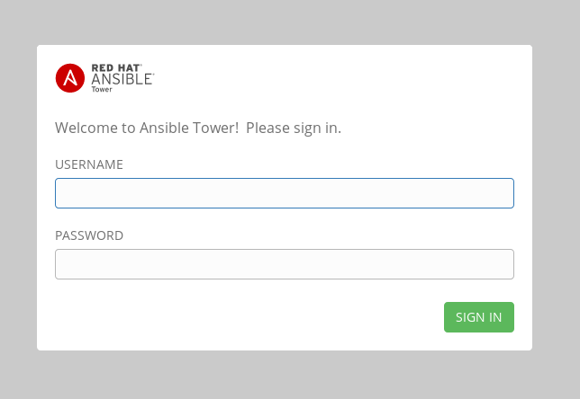

# Exercise 1 - Installing Ansible Tower

In this exercise, we are going to get Ansible Tower installed on your control node

## Installing Ansible Tower


### Step 1:

Change directories to /tmp

```bash
cd /tmp
```

### Step 2:

Download the Ansible Tower v3.3.1 package

```bash
curl -O https://releases.ansible.com/ansible-tower/setup/ansible-tower-setup-3.3.1-1.tar.gz
```
**NOTE**
That curl option is the letter O, and not the number 0.

### Step 3:

Untar and unzip the package file

```bash
tar xvfz /ansible-tower-setup-3.3.1-1.tar.gz
```

### Step 4:

Change directories into the ansible tower package

```bash
cd /ansible-tower-setup-*/
```

### Step 5:

Using an editor of your choice, open the inventory file

```bash
vim inventory
```

### Step 6:

Fill a few variables out in an inventory file: `admin_password, pg_password, rabbitmq_password`

```ini
[tower]
localhost ansible_connection=local

[database]

[all:vars]
admin_password='ansibleWS'

pg_host=''
pg_port=''

pg_database='awx'
pg_username='awx'
pg_password='ansibleWS'

rabbitmq_username=tower
rabbitmq_password='ansibleWS'
rabbitmq_cookie=cookiemonster

# Isolated Tower nodes automatically generate an RSA key for authentication;
# To disable this behavior, set this value to false
# isoldated_key_generation=true

```

### Step 7:

Run the Ansible Tower setup script

```bash
sudo ./setup.sh
```

---
**NOTE**
Step 7 will take approx. 20-25 minutes to complete.  This may be a good time to take a break.

---


### End Result

At this point, your Ansible Tower installation should be complete.
You can access your Tower through a browser at your *control node* IP.

```bash
https://X.X.X.X
```

### Ensuring Installation Success

You know you were successful if you are able to browse to your Ansible Tower's url (_control node's IP address_) and get something like this



---

[Click Here to return to the Ansible Lightbulb - Ansible Tower Workshop](../README.md)
