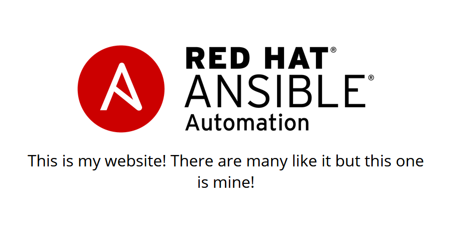

# Exercise 3 - Creating and Running a Job Template

A job template is a definition and set of parameters for running an Ansible job. Job templates are useful to execute the same job many times.


## Creating a Job Template

### Step 1:

Select TEMPLATES


### Step 2:

Click on ADD , and select JOB TEMPLATE

### Step 3:

Complete the form using the following values

NAME |Apache Basic Job Template
-----|-------------------------
DESCRIPTION|Template for the apache-basic-playbook
JOB TYPE|Run
INVENTORY|Ansible Workshop Inventory
PROJECT|Ansible Workshop Project
PLAYBOOK|examples/apache-basic-playbook/site.yml
MACHINE CREDENTIAL|Ansible Workshop Credential
LIMIT|web
OPTIONS|- [x] Enable Privilege Escalation
EXTRA VARIABLES| apache_test_message: <Be creative, keep it clean, we're all professionals here>


### Step 4:

Click SAVE  


## Running a Job Template

Now that you've sucessfully creating your Job Template, you are ready to launch it.
Once you do, you will be redirected to a job screen which is refreshing in realtime
showing you the status of the job.


### Step 5:

Select TEMPLATES


---
**NOTE**
Alternatively, if you haven't navigated away from the job templates creation page, you can scroll down to see all existing job templates

---

### Step 6:

Click on the rocketship icon  for the *Apache Basic Job Template*

### Step 7:

Sit back, watch the magic happen!

One of the first things you will notice is the summary section.  This gives you details about your job such as who launched it, what playbook it's running, what the status is, i.e. pending, running, or complete.


Scrolling down, you will be able to see details on the play and each task in the playbook.


To the right, you can view standard output; the same way you could if you were running Ansible Core from the command line.


### Step 8:

Once your job is sucessful, navigate to your new website

```bash
http://<IP_of_any_node>
```

If all went well, you should see something like this, but with your own custom message:




## End Result
At this point in the workshop, you've experienced the core functionality of Ansible Tower.  But wait... there's more! You've just begun to explore the possibilities of Ansible Core and Tower.  Take a look at the resources page in this guide to explore some more features.


---

[Click Here to return to the Ansible Lightbulb - Ansible Tower Workshop](../README.md)
