# Exercise 4 - Using Ansible to Implement Security

In this exercise, we are going to use Red Hat Ansible Tower to run a Defense Information Systems Agency Security Technical Implementation Guide (DISA STIG) evaluation of our environment. This will allow you to ensure certain security requirements are met in your applications. You can view the role details at the following URL.

      -http://galaxy.ansible.com/redhatofficial/rhel7_disa_stig

## Download the role to Ansible roles directory


### Step 1:

In your shell in a box window, type the following:
sudo ansible-galaxy install redhatofficial.rhel7_disa_stig -p /etc/ansible/roles

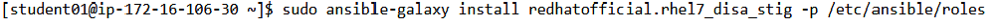

The image below illustrates that the role has been downloaded to your system-wide Ansible roles directory, /etc/ansible/roles

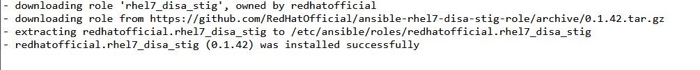

## Create the Project

### Step 2: 

In the Ansible Tower UI click on the projects tab

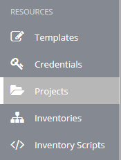


### Step 3: 

Select ADD 

### Step 4: 

Complete the form using the following entries

NAME | Ansible STIG Projects
-----|----------------------
DESCRIPTION | STIG Role Playbook
ORGANIZATION | Default
SCM TYPE | Git
SCM URL | https://github.com/ajacocks/rhel7_disa_stig.git
SCM BRANCH |
SCM UPDATE OPTIONS | [X] Clean <br /> [X] Delete on Update <br /> [X] Update on Launch


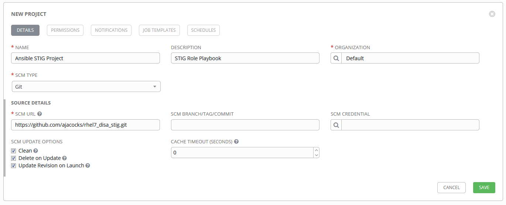

### Step 5: 

Select SAVE 

## Create the Job Template

### Step 6: 

In your Tower UI click Templates from the sidebar

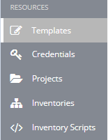

### Step 7: 

Select ADD  and select "Job Template"

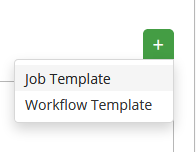


### Step 8: 

Complete the form using the following entries. Note that the PLAYBOOK field should offer main.yml as an option when clicked.

NAME | STIG Job Template
-----|------------------
DESCRIPTION | Template for security playbooks
JOB TYPE | Run
INVENTORY | Ansible Workshop Inventory
PROJECT | Ansible STIG Project
PLAYBOOK | main.yml
MACHINE CREDENTIAL | Ansible Workshop Credential
LIMIT | web
SKIP TAGS | CCE-27361-5 <br /> CCE-27485-2 <br /> CCE-27311-0 <br /> CCE-80546-5
OPTIONS | [X] Enable Privilege Escalation

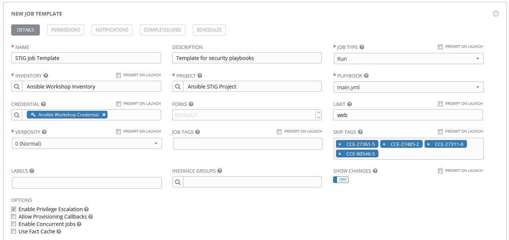

### Step 9: 

Select SAVE  to store your new template, and we are ready to run it.

## Run the Job Template

### Step 10:

Click the rocketship icon  next to the STIG Job Template entry to launch the job.

## Observe the Scanning Process and View Reports

### Step 11:

View what the job looks like after executing

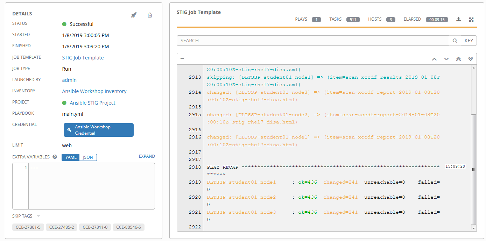

### Step 12:

Once the check is complete, you can open a new tab in your web browser, and navigate to the following URL.
``` bash
http://<IP_of_any_web_node>/scap 
```
### Step 13:

Click the link called scan-xccdf-report to review the SCAP report that was generated. And explore the information available in the report.

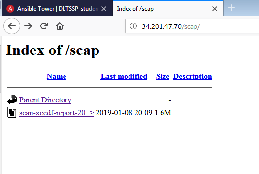

Note the failures in the report; look at the machines, if you want, via your shell in a box ssh session, to analyze what the problems might be.

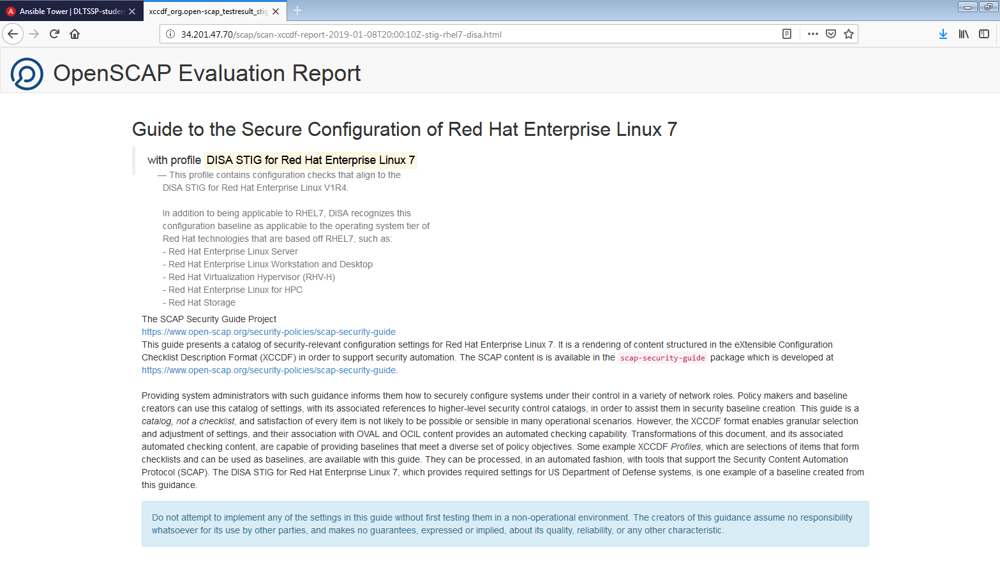

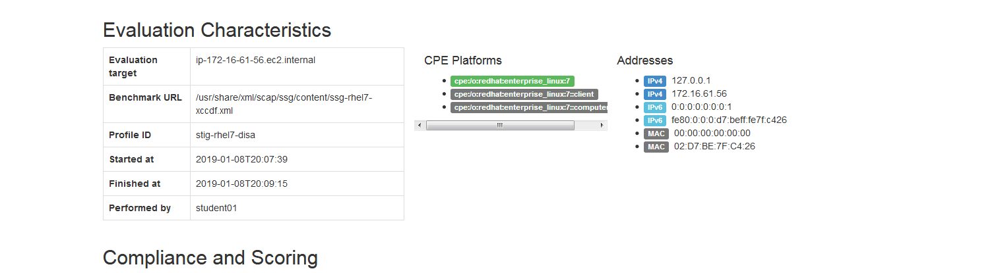

---

[Click Here to return to the Ansible Lightbulb - Ansible Tower Workshop](../README.md)
